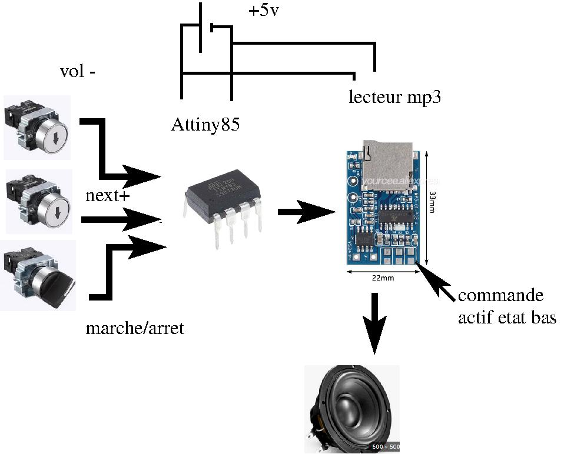

# mp3_mental_disabled
mp3_mental_disabled is a simplified MP3 speaker designed for people with intellectual disabilities. It focuses on ease of use, minimal controls, and clear audio playback. The project aims to provide an accessible, reliable, and stress-free music experience using simple hardware and software.

## MP3 Player for People with Mental Disabilities

One of my daughters is 80% mentally disabled. To give you an idea, at 20 years old she has the IQ of a 3-4 year old child.

She can learn certain things, but it takes quite a bit of time. We leave her an MP3 speaker because she loves listening to music.

The problem: These speakers have 3 buttons, and depending on how long you press them, the function changes. When she wants to change the song, she presses pretty much everything and switches the speaker to radio or Bluetooth mode, and I have to put it back in the right mode quite regularly. I don't have time for just that!

I'm using an Attiny85 as an interface between the MP3 PCB and the human to simulate the correct button presses and limit them to next+ and volume down.

I was inspired by jbd's journal at https://linuxfr.org/users/jbd/journaux/hacking-d-une-machine-a-pain
The point that was giving me trouble was using optocouplers. I found something better! No optocouplers needed!

Since the inputs are active low, I use the Tiny's LOW output, and for "no press" I set the pin as an input (so in high impedance state).

To pull to ground:
cpp

void setPinLow(uint8_t pin) {
  digitalWrite(pin, LOW);
  pinMode(pin, OUTPUT);
}

**Important:** set to LOW BEFORE switching to output mode

And to float (high impedance):
cpp

void setPinHighZ(uint8_t pin) {
  pinMode(pin, INPUT);
  digitalWrite(pin, LOW); // (just in case)
}

So no optocoupler and I'm using 4 pins out of 6 on the Tiny. At startup, I increase the volume, then I limit button presses.
The next track can only be selected after 5 seconds, so she actually listens a bit before changing :)

It's possible to completely mute the sound, but a simple power cycle restores the volume level.
To increase the volume more and more, just do several power cycles in a row.

In short: simple, effective, and it gives the person autonomy. If I tell her to stop the music, she can do it, change tracks, lower the volume too.

And she can stop it herself to go to sleep. IN SHORT: it's brilliant!

Why choose the Tiny85? I always feel a bit bad using only 4 pins out of 40 on a microcontroller. Low power consumption, 1MHz speed, variable supply voltage. Very flexible to use and very cheap. A bit difficult to program because you need an Arduino in ISP mode as an interface between the Tiny and Arduino IDE.
