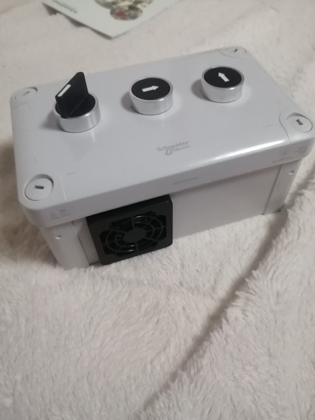
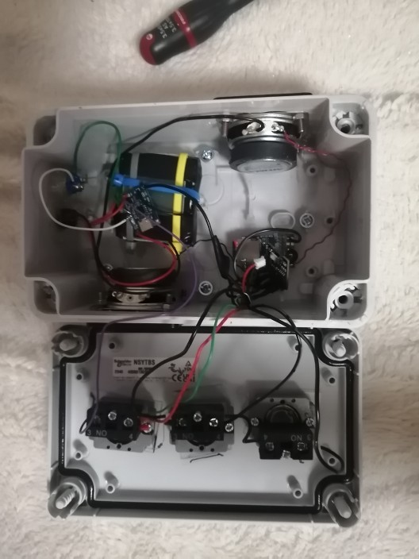
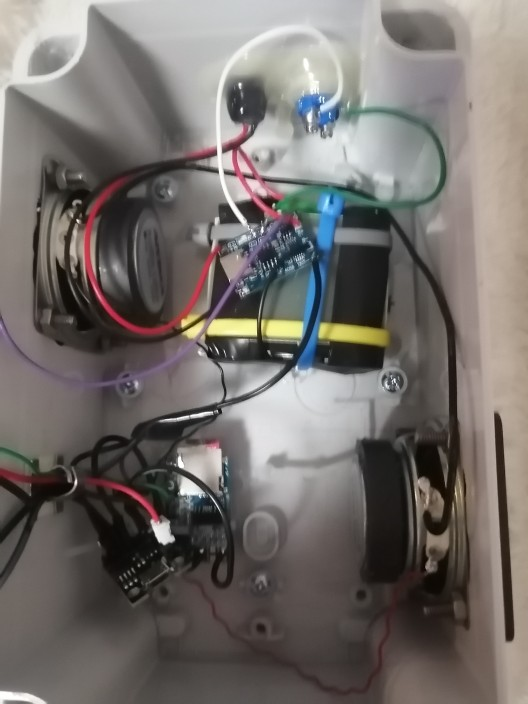
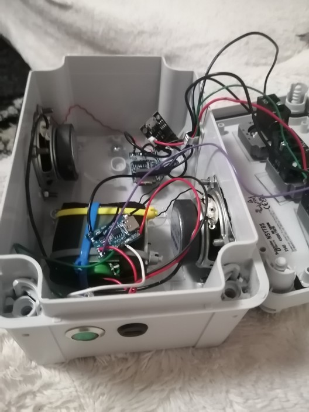
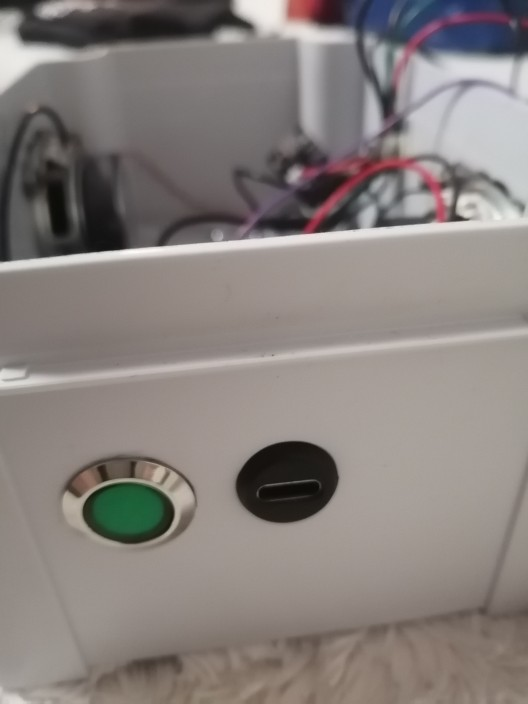

# mp3_mental_disabled
mp3_mental_disabled is a simplified MP3 speaker designed for people with intellectual disabilities. It focuses on ease of use, minimal controls, and clear audio playback. The project aims to provide an accessible, reliable, and stress-free music experience using simple hardware and software.






##  MP3 Player for People with Mental Disabilities

One of my daughters is 80% mentally disabled. To give you an idea, at 20 years old she has the IQ of a 3-4 year old child.

She can learn certain things, but it takes quite a bit of time. We leave her an MP3 speaker because she loves listening to music.

The problem: These speakers have 3 buttons, and depending on how long you press them, the function changes. When she wants to change the song, she presses pretty much everything and switches the speaker to radio or Bluetooth mode, and I have to put it back in the right mode quite regularly. I don't have time for just that!

I'm using an Attiny85 as an interface between the MP3 PCB and the human to simulate the correct button presses and limit them to next+ and volume down.

I was inspired by jbd's journal at https://linuxfr.org/users/jbd/journaux/hacking-d-une-machine-a-pain
The point that was giving me trouble was using optocouplers. I found something better! No optocouplers needed!

Since the inputs are active low, I use the Tiny's LOW output, and for "no press" I set the pin as an input (so in high impedance state).

To pull to ground:
```
cpp

void setPinLow(uint8_t pin) {
  digitalWrite(pin, LOW);
  pinMode(pin, OUTPUT);
}

**Important:** set to LOW BEFORE switching to output mode

And to float (high impedance):
cpp

void setPinHighZ(uint8_t pin) {
  pinMode(pin, INPUT);
  digitalWrite(pin, LOW); // (just in case)
}
```

So no optocoupler and I'm using 4 pins out of 6 on the Tiny. At startup, I increase the volume, then I limit button presses.
The next track can only be selected after 5 seconds, so she actually listens a bit before changing :)

It's possible to completely mute the sound, but a simple power cycle restores the volume level.
To increase the volume more and more, just do several power cycles in a row.

In short: simple, effective, and it gives the person autonomy. If I tell her to stop the music, she can do it, change tracks, lower the volume too.

And she can stop it herself to go to sleep. IN SHORT: it's brilliant!

## list of equipment

### I particularly recommend the French manufacturer of polycarbonate boxes, which are resistant and unbreakable schneider electrique :
The cover is closed with four captive flat screws located outside the sealed area of the enclosure to maintain the IP rating. It is TÜV and UL certified and is fire resistant up to 960°C in accordance with IEC 62208. It offers high protection against dust and water with an IP66 rating (NEMA 4.4X). It is impact resistant (IK08 rating, IEC 62262). It also has Class II electrical insulation, which prevents electric shocks and offers fully insulated solutions. It can be stored at temperatures between -15 and 60°C and used between -25 and 80°C without affecting its performance.

 *  https://www.se.com/fr/fr/product/NSYTBP16128/panelset-bo%C3%AEte-industrielle-164x121x87mm-pc/
 *  PanelSeT - boîte industrielle - 164x121x87mm - PCNSYTBP16128

 *  1Pcs Metal Round Socket Module
 *  https://fr.aliexpress.com/item/1005005363341111.html

 *  AIYIMA 2 pièces 2 "pouces 4 Ohm 3W gamme
 *  https://fr.aliexpress.com/item/32593991938.html

 *  https://fr.aliexpress.com/item/1005007445592831.html
 * 
 *  Ttiny85 Digispark Kickstarter Micro USB
 *  https://fr.aliexpress.com/item/1005009004637470.html

 *  Audio MP3 TF 2W 5V
 *  https://fr.aliexpress.com/item/1005009187267335.html

   


Why choose the Tiny85? I always feel a bit bad using only 4 pins out of 40 on a microcontroller. Low power consumption, 1MHz speed, variable supply voltage. Very flexible to use and very cheap. A bit difficult to program because you need an Arduino in ISP mode as an interface between the Tiny and Arduino IDE.

# programming Attiny85

Unfortunately, programming the Tiny85 is not easy. You need an Arduino UNO with ISP mode available in Arduino IDE, connect it to your computer, and connect the Tiny85 to the Arduino UNO. There are some good tutorials on the internet.
